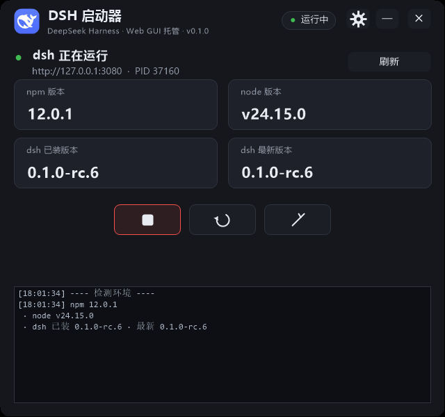
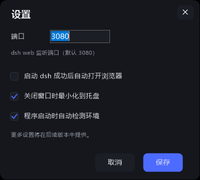

# DSH 启动器（DshLauncher）

> 一个轻量的 Windows 托盘小工具：一键检测、启动、停止、重启 **DeepSeek Harness（dsh）** Web 界面，支持托盘驻留与可扩展设置。

[](https://github.com/JoeyLeaf/dsh-launcher/releases)
[](https://github.com/JoeyLeaf/dsh-launcher)
[](LICENSE)

## ✨ 功能特性

- **环境检测**：启动即检测 npm / node / dsh 已装版本与 npm 最新版本（断网时友好提示）
- **运行状态**：三重确认（端口监听 + HTTP 应答 + 进程特征），绿/红/琥珀状态灯一目了然
- **完整控制**：启停合并按钮（▶ 启动 / ■ 停止）+ 重启 + 打开页面，图标采用 [Lucide](https://lucide.dev) 官方图标（Obsidian 同款）
- **一键安装**：环境缺失时版本卡片直接变为安装按钮——先一键装 **Node.js 便携版**（自动下载最新 LTS，免管理员），再一键装 dsh
- **智能更新**：检测到 dsh 新版本时，已装版本卡片旁出现「更新」徽标，点击即升级（日志实时回显）
- **托盘驻留**：`—` 最小化到任务栏，`✕` 最小化到托盘；托盘菜单一键操作
- **设置面板**：右上角齿轮进入——端口、自动开浏览器、关闭最小化到托盘、启动时自动检测、**界面语言（中文 / English）**、**界面缩放（85/100/115%）**（配置持久化，可扩展）
- **单实例**：重复打开只聚焦已有窗口
- **零依赖**：单文件 exe（约 70KB），无需安装任何运行时 / SDK / npm 包；图标为内嵌 SVG 路径（Lucide，MIT）

## 🖼️ 截图





## 📦 安装与使用

**方式一：下载 zip 包（推荐）**

1. 从 [Releases](../../releases/latest) 下载 `DshLauncher-v0.1.1.zip`（含 exe 与说明，解压即用）
2. 解压后双击 `DshLauncher.exe`。若弹出 SmartScreen 提示，点击 **「更多信息 → 仍要运行」**（未签名的开源软件属正常现象）
3. 主界面点「启动」拉起 dsh web，「停止 / 重启」管理进程，「打开界面」浏览器访问

**方式二：直接下载 exe**

从 [Releases](../../releases/latest) 下载 `DshLauncher.exe`，双击即用。

**方式三：从源码构建**

```powershell
git clone https://github.com/JoeyLeaf/dsh-launcher.git
cd dsh-launcher
powershell -ExecutionPolicy Bypass -File .\build.ps1
```

构建仅依赖 Windows 自带的 .NET Framework `csc.exe`，**不需要安装任何 SDK**。

> 系统要求：Windows 10（2019 年 5 月更新及以后）或 Windows 11，内置 .NET Framework 4.8。

## ⚙️ 配置说明

设置保存在 `%APPDATA%\DshLauncher\config.json`：

```json
{
  "port": 3080,              // dsh web 监听端口
  "autoOpenBrowser": false,  // 启动成功后自动打开浏览器
  "minimizeToTray": true,    // 关闭窗口时最小化到托盘
  "autoCheckOnStart": true,  // 程序启动时自动检测环境
  "language": "zh",          // 界面语言：zh / en
  "uiScale": 100             // 界面缩放：85 / 100 / 115（高 DPI / RDP 下可调小）
}
```

配置文件损坏时自动回退默认值，无需手动修复。

## 🛠️ 调试参数

```powershell
.\DshLauncher.exe --selftest            # 无界面自检（在 3081 端口做安全试验）→ selftest.log
.\DshLauncher.exe --shot main.png       # 用 PrintWindow 抓主窗口渲染 → main.png
.\DshLauncher.exe --shot-settings s.png # 抓设置对话框渲染
.\DshLauncher.exe --shot-icon i.png     # 导出应用图标
```

## 📁 项目结构

```
DshLauncher.cs      # 入口 + 主窗口（全自绘）+ 托盘 + 自检/截图调试
Theme.cs            # 深色主题、圆角控件、日志视图、官方鲸鱼图标渲染
SettingsForm.cs     # 设置模型 + JSON 配置存储 + 设置对话框（自绘）
DshService.cs       # dsh 检测 / 启动 / 停止 / 重启 / 更新（纯子进程调用）
build.ps1           # 编译脚本（系统自带 csc，零依赖）
```

## ❓ 常见问题

**Q：双击后 Windows 提示"已保护你的电脑"？**
A：这是 Windows 对**未签名 exe** 的默认安全提示，属于正常现象。点击 **「更多信息 → 仍要运行」** 即可。本项目完全开源，介意安全性的用户可自行从源码构建（`build.ps1`），构建过程不依赖任何第三方工具。

**Q：提示找不到 dsh？**
A：首次使用（从未安装过 dsh）时，检测区「dsh 已装版本」会显示**「未安装」**，状态栏会提示"未检测到 dsh"——直接点 **「更新 dsh」** 即可自动安装，装完再点「启动」。若提示"未检测到 npm / Node.js"，请先到 [nodejs.org](https://nodejs.org) 安装 Node.js（自带 npm）。

**Q：端口被其他程序占用？**
A：停止按钮会做三重确认，仅结束 dsh 进程；状态显示"未运行"而非误报。可在设置中更换端口。

## 📄 开源协议

[MIT](LICENSE) © 2026 JoeyLeaf

> 应用图标使用 DeepSeek 官方鲸鱼图形（来自 dsh 项目自带 favicon.svg），版权归 DeepSeek 所有。

